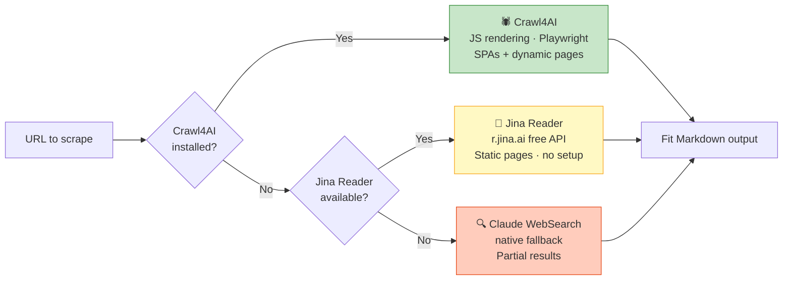

# benchmark

> **Claude skill** for producing competitive benchmarks following a structured consulting methodology — from scoping to structured, sourced, PPT-ready output.

Validated on the **Velora LMD France benchmark** (Feb. 2026) across 4 iterations.

The skill ships **no brand charter**: visual identity is resolved per mission through `references/branding.md` (an external brand skill, a token file, or a neutral fallback). It runs on any organisation's charter.

It also ships **no hardcoded subject**. Two independent axes drive every mission:

- **`benchmark_nature`** decides the method: dimension sub-fields, deliverable set, recommendation frame, scorecard sections, screenshot intents. Profiles: `offer` (offers and pricing), `maturity` (assessment on a grid: ESG, data, AI, cyber), `generic` (explicit fallback).
- **`sector`** decides where to look: sources, queries, vocabulary, known traps.

A new subject in a known method costs one search module. A new method costs one profile file. Comparable figures live in a single long-format `comparables[]` table, so a new metric is a new row, never a new schema block.

---

## What it does

You describe a market and a client. The skill does the rest: asks the right scoping questions, researches every competitor on the web, produces structured actor sheets with sourced data, a pricing comparison, a target population analysis, and an executive summary — all in Markdown + JSON, ready to feed a PPT generation skill.

---

## 8-Phase Workflow

```mermaid
flowchart TD
    A([🚀 /benchmark]) --> B

    subgraph P0["Phase 0 — Initialization"]
        B[Scan CLAUDE.md + sources/ + MEMORY.md]
        B --> C[Detect scraper\nCrawl4AI / Jina / WebSearch]
        C --> D[Interactive scoping\n5 questions — one at a time]
        D --> E[Confirm mission brief\n& save mission-config.json]
    end

    E --> F

    subgraph P1["Phase 1 — Data Collection"]
        F[For each actor ×N]
        F --> G[1. Check client docs in sources/]
        G --> H[2. Scrape official website]
        H --> I[3. Targeted WebSearch\nfinancials · KPIs · messaging]
        I --> J[Missing data protocol\nN/D · ESTIMATION · à vérifier]
    end

    J --> K

    subgraph P2["Phase 2 — Per-Actor Analysis"]
        K[Structured actor sheet\nper format-templates.md]
        K --> L[Header · 4-dim table\nÀ retenir · INSIGHTS · Sources]
        L --> M[Save actors/actor-slug.md\n+ update benchmark.json]
    end

    M --> N

    subgraph P3["Phase 3 — Synthesis"]
        N[3a — Pricing synthesis\ncomparison table · degressivity · transparency index]
        N --> O[3b — Target population analysis\nINSEE funnel · segments · messaging]
        O --> P[3c — Executive summary\ngap · opportunity · lever · risk]
    end

    P --> Q

    subgraph P4["Phase 4 — Final Output"]
        Q[Assemble & validate benchmark.json]
        Q --> R[Automated validation\n+ manual checklist]
        R --> S[Delivery summary to consultant]
    end

    S --> U

    subgraph P567["Phases 5-7 — Report, score, iterate"]
        U[Phase 5 — Self-contained HTML report\nbranding resolved per mission]
        U --> V[Phase 6 — Scorecard\nscored on the applicable total]
        V --> W{score >= 90%?}
        W -- No --> X[Phase 7 — Fix corrigeable gaps\nregenerate · re-score · max 3 iterations]
        X --> V
    end

    W -- Yes --> T([📦 outputs/mission-slug/\nactor sheets · synthesis · exec summary · JSON · HTML · scorecard])

    style P0 fill:#e8f4fd,stroke:#2196F3
    style P1 fill:#fff3e0,stroke:#FF9800
    style P2 fill:#f3e5f5,stroke:#9C27B0
    style P3 fill:#e8f5e9,stroke:#4CAF50
    style P4 fill:#fce4ec,stroke:#E91E63
    style P567 fill:#ede7f6,stroke:#5E35B1
```



---

## Evidence screenshots

Competitor pages are captured in one deterministic pass, not by each research agent:

```bash
python scripts/capture.py --check   # capture=playwright derivatives=pillow | capture=none
python scripts/capture.py --plan outputs/<mission>/capture-plan.json --out outputs/<mission>/actors/screenshots
```

- Actor agents **nominate** targets (`intent`, `url`, `selector_hint`, the `claim` the shot proves). The orchestrator captures.
- One browser, one context per actor, identical viewport and settings, so every screenshot in a report looks like it belongs to the same document.
- Consent banners are handled from `scripts/consent.json` (Didomi, OneTrust, Axeptio, Sirdata, Cookiebot, tarteaucitron and friends). A banner that survives a mission is fixed by adding a handler to that file, never by patching the script.
- Determinism: trackers blocked, animations frozen, lazy loading triggered, sticky headers hidden, device scale factor 2.
- Two outputs per shot: a full-resolution PNG for decks, and a captioned derivative (actor, URL, capture date) around 100 to 250 KB that gets inlined in the HTML report.
- Blocked pages (captcha, WAF, login) are reported as structural gaps, never faked with a placeholder.

A dated, URL-stamped capture counts as a source for the figure it displays.

---

## Output Structure (per actor)

```
┌─────────────────────────────────────────────────────────────┐
│  [Logo]  Actor Name  ·  Category  ·  B2B / B2C              │
│  Tagline: "..."                                              │
│  Key figures: X clients · Y€ revenue · Z vehicles           │
├────────────────────────┬───────────┬────────────┬──────────┤
│ Dimension              │ Offer     │ Targets    │ Pricing  │
│                        │ Content   │ & TOV      │          │
├────────────────────────┼───────────┼────────────┼──────────┤
│ Offer & Promise        │ ...       │ ...        │ ...      │
│ Service Content        │ ...       │ ...        │ ...      │
│ Targets & Messaging    │ ...       │ ...        │ ...      │
│ Pricing & Vehicle      │ ...       │ ...        │ ...      │
├────────────────────────┴───────────┴────────────┴──────────┤
│ 📌 À retenir: [1 differentiating sentence — max]            │
├─────────────────────────────────────────────────────────────┤
│ INSIGHTS                                                    │
│ ✅ Strong differentiator 1                                  │
│ ✅ Strong differentiator 2                                  │
│ ⚠️  Risk or weakness                                        │
├─────────────────────────────────────────────────────────────┤
│ Sources: [URL 1] · [URL 2] · [Doc client p.X]               │
└─────────────────────────────────────────────────────────────┘
```

**Output files per mission:**

```
outputs/
└── mission-slug/
    ├── mission-config.json       ← scoping parameters (auto-saved)
    ├── actors/
    │   ├── actor-1.md
    │   ├── actor-2.md
    │   └── ...
    ├── pricing-synthesis.md      ← comparison table + degressivity (commercial)
    ├── targets-analysis.md       ← population funnel + segment mapping
    ├── market-landscape.md       ← segment x category map
    ├── exec-summary.md           ← gap · opportunity · lever · risk
    ├── recommendation.md         ← Standard / Singularité / Unicité
    ├── benchmark.json            ← full structured data (feeds PPT skill)
    ├── benchmark-report.html     ← self-contained navigable report
    └── benchmark-scorecard.md    ← quality score + classified gaps
```

---

## Scraping Architecture

The skill automatically detects and uses the best available tool:



| Level | Tool | Best for | Setup |
|-------|------|----------|-------|
| 1 | **Crawl4AI** | SPAs, login-gated pages, JS-heavy sites | `bash scripts/setup-scraper.sh` |
| 2 | **Jina Reader** | Static pages, most official sites | None — always available |
| 3 | **Claude WebSearch** | Financial KPIs, press coverage, market data | None — native fallback |

> **Note**: Crawl4AI and WebSearch are complementary. Crawl4AI handles brand/pricing pages; WebSearch is required for financial data (revenue, P&L) on third-party sources (societe.com, Infogreffe, press releases).

---

## Skill File Structure

```
benchmark/
├── SKILL.md                          ← Orchestration (Phase 0 → 7) + Quality Rules
├── evals/
│   ├── evals.json                    ← 7 end-to-end cases (incl. RSE + iteration loop)
│   └── trigger-eval.json             ← 22 trigger cases (12 positive / 10 negative)
├── references/
│   ├── methodology.md                ← Dimension framework + claim verification protocol
│   ├── dimension-library.md          ← Sector-specific dimension configurations
│   ├── format-templates.md           ← Markdown templates (1-7) + mission config
│   ├── data-sources.md               ← Sourcing protocol + scraper levels + markers
│   ├── output-schemas.md             ← JSON schema + Markdown→JSON mapping
│   ├── profiles/                     ← One file per benchmark_nature (method)
│   ├── recommendation-framework.md   ← Standard / Singularité / Unicité (offer)
│   ├── capture-spec.md               ← Screenshot intents, plan, manifest, evidence rules
│   ├── branding.md                   ← Branding contract (no charter embedded)
│   ├── html-report-spec.md           ← Report structure, radar, design system
│   ├── scorecard.md                  ← Scoring criteria + applicability model
│   ├── iteration-loop.md             ← Correction protocol + convergence rules
│   ├── examples/                     ← Saved validated deliverables
│   └── agent-prompts/                ← Subagent prompts + sector search modules
└── scripts/
    ├── scrape.py                     ← Universal scraper (auto-detects best tool)
    ├── capture.py                    ← Deterministic screenshot capture
    ├── consent.json                  ← Consent-banner handlers (data, grows per mission)
    ├── setup-scraper.sh              ← Install Crawl4AI + Playwright
    ├── validate_benchmark.py         ← Actor + benchmark validation (type-aware)
    └── extract_pdf.py                ← PDF/PPTX → PNG extraction
```

---

## Installation

### Option A — Claude Code (CLI)

The skill runs directly in your terminal with `claude` CLI.

**1. Clone or download the skill files**
```bash
git clone https://github.com/yannick-bottino/consulting-claude-skills.git
```

**2. Copy to your project's skills folder**
```bash
mkdir -p your-project/.claude/skills/
cp -r consulting-claude-skills/skills/benchmark/ your-project/.claude/skills/benchmark/
```

**3. (Optional) Install Crawl4AI for JS rendering**
```bash
bash your-project/.claude/skills/benchmark/scripts/setup-scraper.sh
```

**4. Verify scraper**
```bash
python your-project/.claude/skills/benchmark/scripts/scrape.py --check
# Returns: scraper=crawl4ai | scraper=jina | scraper=none
```
> **Windows**: use `python`, not `python3` (Microsoft Store stub issue).

**5. Invoke**

In your project directory, run `claude` then type:
```
/benchmark
```
The skill will start with Phase 0 — interactive scoping.

---

### Option B — CoWork (plugin)

CoWork loads skills as plugins from your `.claude/skills/` directory.

**1. Place the skill in your CoWork workspace**
```
workspace/
└── .claude/
    └── skills/
        └── benchmark/   ← paste here
```

**2. Reload Claude in CoWork** (or restart the session)

**3. Invoke via slash command**
```
/benchmark
```

> To customize the skill for your organization (brand, default sectors, language), use the `cowork-plugin-customizer` skill:
> ```
> /cowork-plugin-customizer benchmark
> ```

---

### Option C — Claude.ai Projects

For teams using Claude.ai without the CLI.

**1. Create a new Project** on [claude.ai/projects](https://claude.ai/projects)

**2. Add the skill content to Project instructions**

Open Project Settings → Custom Instructions, then paste the full content of `SKILL.md`.

**3. Upload reference files**

In the Project Knowledge section, upload every file in `references/`: at minimum `methodology.md`, `dimension-library.md`, `format-templates.md`, `data-sources.md`, `output-schemas.md`, `scorecard.md`, `iteration-loop.md`, `html-report-spec.md`, `branding.md`.

**4. Invoke**

In any conversation in the Project, type:
```
Lance le benchmark concurrentiel
```
or
```
/benchmark
```

> **Limitation**: the `scrape.py` script cannot run on claude.ai (no terminal access). The skill will fall back to Jina Reader (via WebFetch) and Claude's native WebSearch automatically.

---

## Quality Standards

Single source of truth: the **Quality Rules** block in `SKILL.md`, organised in themes (D data integrity, S sourcing, F format, G genericity, P process). Marker syntax lives in `references/data-sources.md`.

In short: no figure without a source, no claim without a verbatim, no fabricated cell to avoid a gap.

---

## Evaluation Results

Validated on **Velora LMD France** (10 actors, 4 dimensions, 12-month scope):

| Iteration | Auto score | Human score | Total | Key improvement |
|-----------|-----------|-------------|-------|-----------------|
| 1 | 61/61 | 39/39 | **100/100** | Baseline |
| 2 | 61/61 | 39/39 | **100/100** | Live pricing Carvio (726€ vs 519€ estimate) |
| 3 | 61/61 | 39/39 | **100/100** | Peer discovery (17 actors), financial insight |
| 4 | 61/61 | 38.5/39 | **99.5/100** | Crawl4AI only — 7 URLs scraped live |

Scores above use the legacy 100-point scale of that campaign. The current scorecard (`references/scorecard.md`) scores a percentage of the sections applicable to the mission, so totals are not comparable across benchmark types.

Test cases in `evals/evals.json`: insurance, LMD automotive, B2B telco, coworking peer discovery, custom dimensions, RSE end-to-end, iteration loop.

---

## Dimensions Library

The skill auto-detects the market sector and proposes adapted dimensions. Configurable by mission.

| Sector | Dim 1 | Dim 2 | Dim 3 | Dim 4 |
|--------|-------|-------|-------|-------|
| **LMD / Mobility** | Offre & Conditions | Contenu du service | Cibles & TOV | Pricing & Véhicule |
| **Insurance** | Garanties & Couverture | Exclusions & Plafonds | Cibles & Distribution | Pricing & Options |
| **B2B Telco** | Offre & Engagement | Services inclus | Cibles & Secteurs | Pricing & Dégression |
| **Default** | Offre & Positionnement | Contenu & Différenciants | Cibles & Messagerie | Pricing & Conditions |

All sector configurations in `references/dimension-library.md` — extensible.

---

## License

Consulting benchmark methodology skill.
